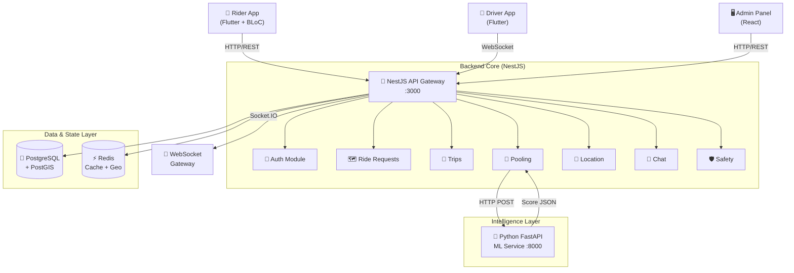
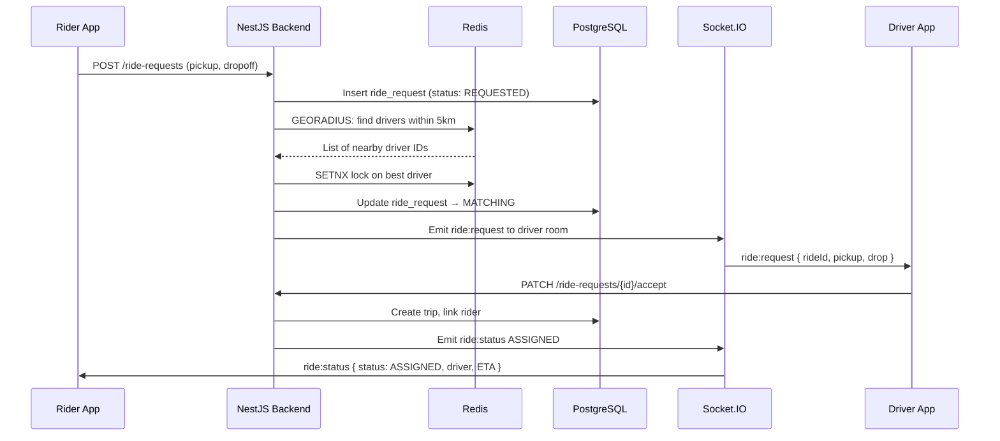
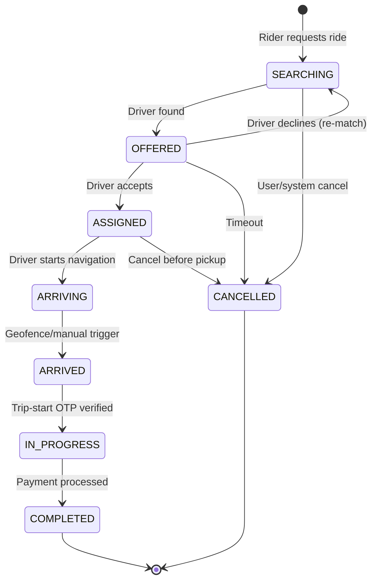
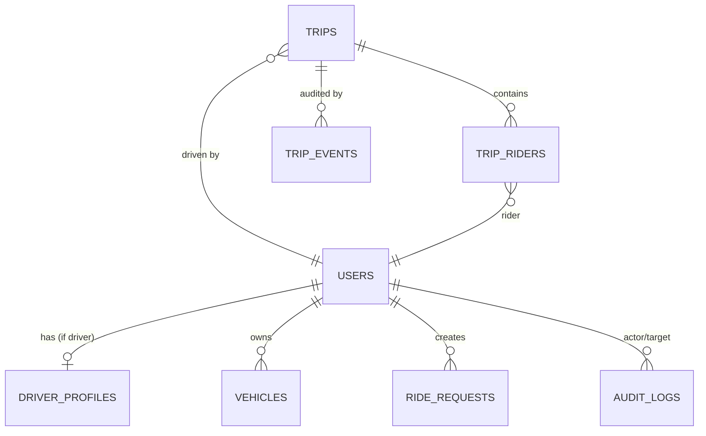
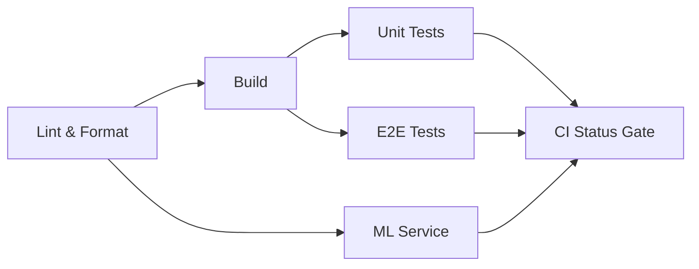
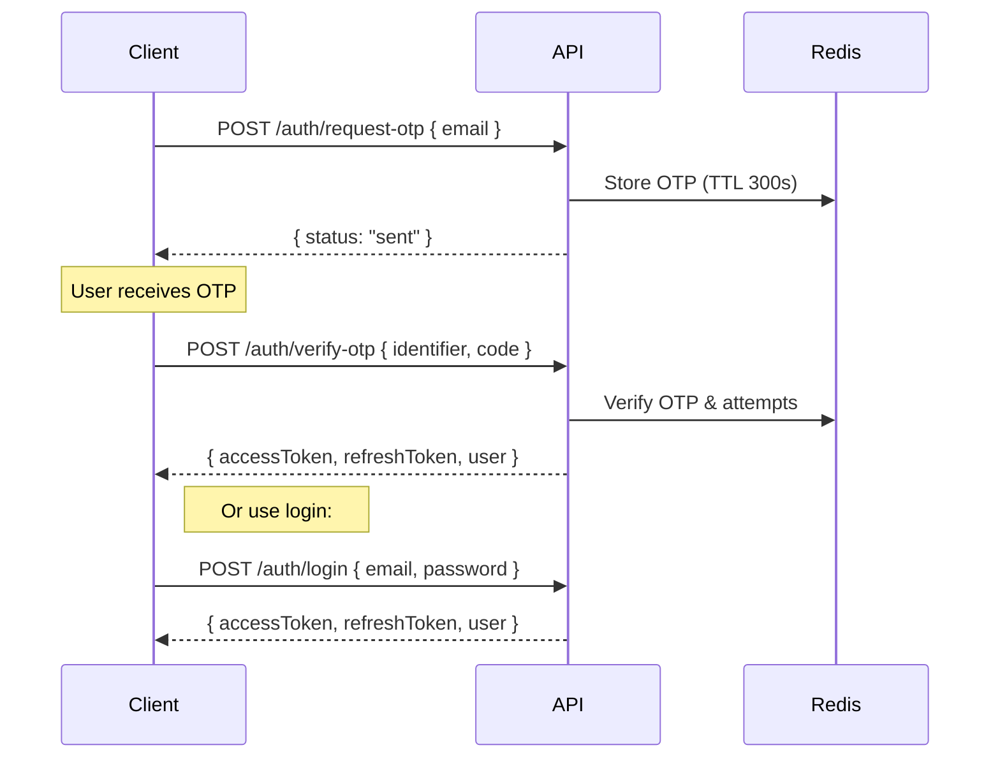

# 🚖 Vectra — Developer Documentation

> **Version**: 1.0.0 · **Last Updated**: March 2026 · **License**: MIT

Vectra is a high-performance, scalable ride-sharing and pooling platform built with a microservice architecture. This document is the single source of truth for every developer working on the project — from local setup all the way through deployment and troubleshooting.

---

## Table of Contents

1. [Project Overview](#1--project-overview)
2. [Repository Structure](#2--repository-structure)
3. [Prerequisites](#3--prerequisites)
4. [Setup Guide](#4--setup-guide)
5. [Architecture & Design](#5--architecture--design)
6. [Backend Modules Deep Dive](#6--backend-modules-deep-dive)
7. [Database Schema](#7--database-schema)
8. [API Documentation](#8--api-documentation)
9. [WebSocket / Real-Time Events](#9--websocket--real-time-events)
10. [ML Service (Intelligence Layer)](#10--ml-service-intelligence-layer)
11. [Frontend Applications](#11--frontend-applications)
12. [Environment Variables Reference](#12--environment-variables-reference)
13. [Coding Standards](#13--coding-standards)
14. [Testing Strategy](#14--testing-strategy)
15. [CI/CD Pipeline](#15--cicd-pipeline)
16. [Deployment Guide](#16--deployment-guide)
17. [Security & Authentication](#17--security--authentication)
18. [Troubleshooting](#18--troubleshooting)
19. [Glossary](#19--glossary)
20. [Contributing](#20--contributing)

---

## 1 · Project Overview

### What is Vectra?

Vectra is an intelligent ride-sharing and pooling ecosystem that optimises urban mobility. It supports:

- **Solo Rides** — Standard single-rider trips.
- **Ride Pooling** — ML-scored grouping of riders with similar routes.
- **Real-Time Tracking** — Live GPS via WebSockets.
- **Fleet & Safety Management** — Admin dashboard, SOS alerts, route-deviation monitoring.

### Key Stats

| Metric               | Value                               |
|:----------------------|:------------------------------------|
| API Endpoints         | 31 (REST)                           |
| Database Tables       | 10 (PostgreSQL + PostGIS)           |
| Backend Modules       | 7 feature modules + infrastructure  |
| Entity Files          | 15 TypeORM entities                 |
| Frontend Apps         | 3 (Rider, Driver, Admin)            |
| CI Pipelines          | 2 GitHub Actions workflows          |

### Tech Stack at a Glance

| Layer           | Technology                                      |
|:----------------|:------------------------------------------------|
| Backend API     | NestJS 10 (Node.js + TypeScript)                |
| Database        | PostgreSQL 16 + PostGIS 3.4                     |
| Cache / Geo     | Redis 7 (ioredis)                               |
| ORM             | TypeORM 0.3                                     |
| Auth            | Passport + JWT (access + refresh tokens)        |
| Real-Time       | Socket.IO 4                                     |
| ML Service      | Python 3.9+ / FastAPI                           |
| Mobile Apps     | Flutter (Dart), BLoC pattern                    |
| Admin Panel     | React (Vite + TypeScript)                       |
| CI/CD           | GitHub Actions                                  |
| Containerisation| Docker + Docker Compose                         |

---

## 2 · Repository Structure

```
Vectra/
├── .github/workflows/
│   └── backend-ci.yml              # Backend-specific CI (lint→build→test→e2e→ML)
├── Code of Conduct.md
├── MIT License.md
├── README.md                       # High-level project README
├── contributing.md                  # Contribution guidelines
│
└── VectraApp/
    ├── .github/workflows/
    │   └── ci.yml                   # Full monorepo CI (all components)
    ├── docker-compose.yml           # PostgreSQL + Redis containers
    ├── DATABASE_README.md           # Database setup walkthrough
    ├── DEVDOCS.md                   # ← You are here
    ├── docs/
    │   ├── Vectra_Architecture_Diagram.png
    │   ├── api-contracts.md
    │   ├── setup.md
    │   └── websocket-events.md
    │
    ├── backend/
    │   ├── .env.example             # Environment template
    │   ├── docker-compose.yml       # Backend + ML service containers
    │   ├── package.json
    │   ├── tsconfig.json
    │   ├── nest-cli.json
    │   ├── .eslintrc.cjs            # ESLint config
    │   ├── .prettierrc              # Prettier config
    │   ├── BACKEND_API.md           # Full API reference (1075 lines)
    │   ├── api-tests.http           # HTTP test file
    │   │
    │   ├── src/
    │   │   ├── main.ts              # App bootstrap (CORS, port)
    │   │   ├── app.module.ts        # Root module (all imports)
    │   │   ├── common/types/        # Shared types
    │   │   ├── database/
    │   │   │   ├── data-source.ts   # TypeORM DataSource config
    │   │   │   ├── schema.sql       # Reference SQL schema
    │   │   │   └── migrations/      # TypeORM migrations
    │   │   ├── integrations/redis/  # Redis module (global)
    │   │   ├── realtime/            # Socket.IO gateway
    │   │   └── modules/
    │   │       ├── Authentication/  # Auth, Users, Drivers, Admin, RBAC, Compliance
    │   │       ├── ride_requests/   # Ride request lifecycle
    │   │       ├── trips/           # Trip management, events
    │   │       ├── pooling/         # Ride pooling & ML integration
    │   │       ├── location/        # Driver GPS tracking
    │   │       ├── chat/            # In-ride messaging
    │   │       └── safety/          # SOS, incidents, deviation
    │   │
    │   ├── ml-service/              # Python ML microservice
    │   │   ├── Dockerfile
    │   │   ├── requirements.txt
    │   │   └── app/
    │   │       ├── main.py          # FastAPI app + endpoints
    │   │       └── api/
    │   │           ├── pooling.py
    │   │           ├── routing.py
    │   │           └── demand.py
    │   │
    │   └── test/                    # E2E tests
    │
    └── frontend/
        ├── shared/                  # Shared Flutter package (API client, models)
        ├── rider_app/               # Flutter rider app (BLoC)
        │   └── lib/{common,config,core,features}/
        ├── driver_app/              # Flutter driver app
        │   └── lib/{core,driver,features,models,screens,services,shared,theme,utils}/
        └── admin_web/               # React admin dashboard
            └── src/
```

---

## 3 · Prerequisites

### Required Software

| Tool              | Version       | Purpose                            |
|:------------------|:--------------|:-----------------------------------|
| **Node.js**       | 18+ (rec. 20) | Backend runtime                    |
| **npm**           | 9+            | Package manager                    |
| **Docker Desktop**| Latest        | PostgreSQL, Redis, ML containers   |
| **Python**        | 3.9+          | ML Service                         |
| **Flutter**       | 3.19+         | Mobile apps                        |
| **Git**           | 2.40+         | Version control                    |

### Recommended Tools

- **pgAdmin** / **DBeaver** / **DataGrip** — Database GUI client
- **Postman** / **REST Client** (VS Code) — API testing
- **VS Code** with extensions: ESLint, Prettier, PostgreSQL, Flutter/Dart

---

## 4 · Setup Guide

### 4.1 Clone the Repository

```bash
git clone <repository-url>
cd Vectra/VectraApp
```

### 4.2 Start Infrastructure (PostgreSQL + Redis)

```bash
# From VectraApp/ root
docker compose up -d
```

This launches:
- **PostgreSQL 16** with PostGIS 3.4 → port `5433` (mapped internally to `5432`)
- **Redis 7** → port `6379`

Verify containers are running:

```bash
docker ps
```

### 4.3 Backend Setup

```bash
cd backend

# Copy environment template
cp .env.example .env

# Edit .env with your database credentials (see section 12)

# Install dependencies
npm install

# Run database migrations
npm run migration:run

# Start in development mode (hot-reload)
npm run start:dev
```

The backend will be available at **`http://localhost:3000`**.

### 4.4 ML Service Setup

**Option A — Docker (recommended):**

```bash
cd backend
docker compose up ml-service
```

**Option B — Local Python:**

```bash
cd backend/ml-service
pip install -r requirements.txt
python -m uvicorn app.main:app --port 8000 --reload
```

The ML service will be available at **`http://localhost:8000`**.

### 4.5 Frontend Apps (Flutter)

```bash
# Rider App
cd frontend/rider_app
flutter pub get
flutter run

# Driver App
cd frontend/driver_app
flutter pub get
flutter run
```

### 4.6 Admin Web (React)

```bash
cd frontend/admin_web
npm install
npm run dev
```

### 4.7 Quick Validation Checklist

| Check | Command | Expected |
|:------|:--------|:---------|
| Database responding | `docker exec -it vectra_db psql -U vectra -d vectra_db -c '\dt'` | Lists tables |
| Redis responding | `docker exec -it vectra_redis redis-cli ping` | `PONG` |
| Backend running | `curl http://localhost:3000` | 200 OK |
| ML service running | `curl http://localhost:8000` | `{"Hello":"World"}` |

---

## 5 · Architecture & Design

### 5.1 High-Level Architecture



### 5.2 Design Principles

| Principle                            | Implementation                                                                   |
|:-------------------------------------|:---------------------------------------------------------------------------------|
| **Modular Monolith**                 | Feature modules with bounded contexts; can be split into microservices later      |
| **Event-Driven Real-Time**           | Socket.IO rooms per trip; location stream every 5s                               |
| **CQRS-lite**                        | Hot data in Redis (driver locations, OTPs), cold data in PostgreSQL              |
| **Soft Delete / Audit Trail**        | No permanent data deletion; `trip_events` and `audit_logs` tables track changes  |
| **DTO Validation**                   | Global `ValidationPipe` with `class-validator` decorators                        |
| **Role-Based Access Control (RBAC)** | `JwtAuthGuard` + `RolesGuard` at controller level                                |

### 5.3 Request Flow (Ride Booking)



### 5.4 Trip Lifecycle (State Machine)



---

## 6 · Backend Modules Deep Dive

The backend is organised into **7 feature modules** plus infrastructure modules:

### 6.1 Authentication Module (`modules/Authentication/`)

The largest module, containing sub-modules for users, drivers, admin, RBAC, and compliance.

| Sub-Module   | Entities                                  | Purpose                                     |
|:-------------|:------------------------------------------|:--------------------------------------------|
| `auth/`      | `refresh-token.entity.ts`                 | OTP, login, JWT issuance, session management |
| `users/`     | `user.entity.ts`                          | User CRUD, profile, data export              |
| `drivers/`   | `driver-profile.entity.ts`, `vehicle.entity.ts` | Driver profiles, vehicles, status management |
| `admin/`     | `admin-audit.entity.ts`                   | User suspension, reinstatement, audit logs   |
| `rbac/`      | `role-change-audit.entity.ts`             | Role-based access control, role changes      |
| `compliance/`| `compliance-event.entity.ts`, `document.entity.ts` | Regulatory compliance tracking        |

### 6.2 Ride Requests Module (`modules/ride_requests/`)

| Entity                   | Purpose                                             |
|:-------------------------|:----------------------------------------------------|
| `ride-request.entity.ts` | Captures ride request lifecycle (REQUESTED → MATCHING → EXPIRED/CANCELLED) |

### 6.3 Trips Module (`modules/trips/`)

| Entity                | Purpose                                          |
|:----------------------|:-------------------------------------------------|
| `trip.entity.ts`      | Core trip record (driver, status, route)         |
| `trip-rider.entity.ts`| Riders within a trip (supports pooling)          |
| `trip-event.entity.ts`| Audit trail of all state transitions             |

### 6.4 Pooling Module (`modules/pooling/`)

| Entity                  | Purpose                                         |
|:------------------------|:------------------------------------------------|
| `pool-group.entity.ts`  | Groups riders with compatible routes             |

Communicates with the ML service via HTTP to get compatibility scores.

### 6.5 Location Module (`modules/location/`)

Handles driver GPS ingestion and geospatial queries.

- **Hot path**: GPS → Redis `GEOADD` (TTL 30s)
- **Cold path**: Async → PostgreSQL `driver_locations`

### 6.6 Chat Module (`modules/chat/`)

| Entity               | Purpose                       |
|:---------------------|:------------------------------|
| `message.entity.ts`  | In-ride bidirectional chat     |

### 6.7 Safety Module (`modules/safety/`)

| Entity                | Purpose                             |
|:----------------------|:------------------------------------|
| `incident.entity.ts`  | SOS triggers, route deviation alerts |

### 6.8 Infrastructure Modules

| Module               | Location                          | Purpose                             |
|:---------------------|:----------------------------------|:------------------------------------|
| **Redis**            | `integrations/redis/`             | Global ioredis provider             |
| **Realtime**         | `realtime/`                       | Socket.IO gateway (auth, rooms)     |
| **Health**           | `health/`                         | Liveness/readiness probes           |
| **Database**         | `database/`                       | TypeORM DataSource, migrations      |

---

## 7 · Database Schema

### 7.1 ER Overview

The database uses **PostgreSQL 16** with the **PostGIS** extension for geospatial queries and **pgcrypto** for UUID generation.



### 7.2 Tables Reference

#### `users`

| Column          | Type           | Constraints                    |
|:----------------|:---------------|:-------------------------------|
| `id`            | UUID (PK)      | `gen_random_uuid()`            |
| `role`          | ENUM           | `RIDER`, `DRIVER`, `ADMIN`     |
| `email`         | TEXT           | UNIQUE                         |
| `phone`         | TEXT           | UNIQUE                         |
| `password_hash` | TEXT           | Nullable (OTP-only auth)       |
| `name`          | TEXT           |                                |
| `status`        | ENUM           | `ACTIVE`, `SUSPENDED`, `DELETED` |
| `created_at`    | TIMESTAMPTZ    | DEFAULT `now()`                |
| `updated_at`    | TIMESTAMPTZ    | DEFAULT `now()`                |
| `last_login_at` | TIMESTAMPTZ    | Nullable                       |

#### `driver_profiles`

| Column               | Type           | Constraints                                   |
|:----------------------|:---------------|:----------------------------------------------|
| `user_id`            | UUID (PK, FK)  | References `users(id)` ON DELETE CASCADE       |
| `verification_status`| ENUM           | `PENDING`, `APPROVED`, `REJECTED`, `SUSPENDED` |
| `rating_avg`         | NUMERIC(3,2)   | DEFAULT `0`                                    |
| `rating_count`       | INT            | DEFAULT `0`                                    |
| `completion_rate`    | NUMERIC(5,2)   | DEFAULT `0`                                    |
| `online_status`      | BOOLEAN        | DEFAULT `FALSE`                                |

#### `vehicles`

| Column                    | Type           | Constraints                              |
|:--------------------------|:---------------|:-----------------------------------------|
| `id`                      | UUID (PK)      | `gen_random_uuid()`                      |
| `driver_user_id`          | UUID (FK)      | References `users(id)` ON DELETE CASCADE |
| `vehicle_type`            | TEXT           | e.g., `Bike`, `Sedan`, `EV`             |
| `make` / `model`          | TEXT           |                                          |
| `plate_number`            | TEXT           | UNIQUE NOT NULL                          |
| `seating_capacity`        | INT            | CHECK `>= 1`                            |
| `emission_factor_g_per_km`| NUMERIC(10,2)  | For CO₂ calculations                     |
| `is_active`               | BOOLEAN        | DEFAULT `TRUE`                           |

#### `ride_requests`

| Column           | Type                   | Constraints                                   |
|:-----------------|:-----------------------|:----------------------------------------------|
| `id`             | UUID (PK)              | `gen_random_uuid()`                           |
| `rider_user_id`  | UUID (FK)              | References `users(id)` ON DELETE CASCADE      |
| `pickup_point`   | GEOGRAPHY(Point, 4326) | NOT NULL — PostGIS geometry                   |
| `drop_point`     | GEOGRAPHY(Point, 4326) | NOT NULL                                      |
| `ride_type`      | TEXT                   | CHECK `IN ('SOLO', 'POOL')`                  |
| `status`         | ENUM                   | `REQUESTED`, `MATCHING`, `EXPIRED`, `CANCELLED` |

> **Index**: `idx_ride_requests_pickup_gist` — GIST index on `pickup_point` for fast radius queries.

#### `trips`

| Column                  | Type          | Constraints                   |
|:------------------------|:--------------|:------------------------------|
| `id`                    | UUID (PK)     |                               |
| `driver_user_id`        | UUID (FK)     | References `users(id)`        |
| `status`                | ENUM          | `REQUESTED`, `ASSIGNED`, `ARRIVING`, `IN_PROGRESS`, `COMPLETED`, `CANCELLED` |
| `current_route_polyline`| TEXT          |                               |
| `assigned_at` / `start_at` / `end_at` | TIMESTAMPTZ | Lifecycle timestamps |

#### `trip_riders` (Junction — supports pooling)

| Column           | Type                   | Constraints                          |
|:-----------------|:-----------------------|:-------------------------------------|
| `trip_id`        | UUID (PK, FK)          | References `trips(id)` CASCADE       |
| `rider_user_id`  | UUID (PK, FK)          | References `users(id)` CASCADE       |
| `pickup_point`   | GEOGRAPHY(Point, 4326) |                                      |
| `drop_point`     | GEOGRAPHY(Point, 4326) |                                      |
| `pickup_sequence`| INT                    | Waypoint ordering                    |
| `drop_sequence`  | INT                    | Waypoint ordering                    |
| `fare_share`     | NUMERIC(10,2)          |                                      |
| `status`         | TEXT                   | `JOINED`, `CANCELLED`, `NO_SHOW`     |

#### `trip_events` (Audit)

| Column       | Type       | Notes                                |
|:-------------|:-----------|:-------------------------------------|
| `id`         | UUID (PK)  |                                      |
| `trip_id`    | UUID (FK)  |                                      |
| `event_type` | TEXT       | e.g., `STATUS_CHANGE`, `ROUTE_UPDATE`|
| `old_value`  | TEXT       |                                      |
| `new_value`  | TEXT       |                                      |
| `metadata`   | JSONB      | Unstructured event data              |

#### `audit_logs` (Admin)

| Column           | Type       | Notes                             |
|:-----------------|:-----------|:----------------------------------|
| `id`             | UUID (PK)  |                                   |
| `actor_user_id`  | UUID (FK)  | Admin who performed the action    |
| `target_user_id` | UUID (FK)  | Affected user                     |
| `action_type`    | TEXT       | e.g., `SUSPEND`, `REINSTATE`      |
| `reason`         | TEXT       |                                   |
| `metadata`       | JSONB      |                                   |

### 7.3 Enums

| Enum Name                     | Values                                                  |
|:------------------------------|:--------------------------------------------------------|
| `user_role`                   | `RIDER`, `DRIVER`, `ADMIN`                              |
| `account_status`              | `ACTIVE`, `SUSPENDED`, `DELETED`                        |
| `driver_verification_status`  | `PENDING`, `APPROVED`, `REJECTED`, `SUSPENDED`          |
| `ride_request_status`         | `REQUESTED`, `MATCHING`, `EXPIRED`, `CANCELLED`         |
| `trip_status`                 | `REQUESTED`, `ASSIGNED`, `ARRIVING`, `IN_PROGRESS`, `COMPLETED`, `CANCELLED` |

### 7.4 Migration Workflow

```bash
# Apply pending migrations
npm run migration:run

# Revert last migration
npm run migration:revert

# Generate a new migration after entity changes
npm run migration:generate -- src/database/migrations/DescriptiveName
```

> ⚠️ **Never modify the database schema manually.** Always use migrations and commit both entity + migration files.

---

## 8 · API Documentation

**Base URL**: `http://localhost:3000/api/v1`

### 8.1 Endpoint Summary

| Category          | Endpoints | Auth Required? | Roles              |
|:------------------|:----------|:---------------|:-------------------|
| **Authentication**| 10        | Mixed          | Public + All       |
| **Profile**       | 6         | JWT            | All                |
| **Driver**        | 5         | JWT            | `DRIVER`           |
| **Ride Requests** | 3         | JWT            | `RIDER`            |
| **Trips**         | 2         | JWT            | All                |
| **Admin**         | 4         | JWT            | `ADMIN`            |
| **Total**         | **31**    |                |                    |

### 8.2 Authentication Endpoints

| #    | Method | Endpoint                  | Auth     | Description             |
|:-----|:-------|:--------------------------|:---------|:------------------------|
| 1.1  | POST   | `/auth/request-otp`       | No       | Request OTP via email   |
| 1.2  | POST   | `/auth/register/rider`    | No       | Register new rider      |
| 1.3  | POST   | `/auth/register/driver`   | No       | Register new driver     |
| 1.4  | POST   | `/auth/verify-otp`        | No       | Verify OTP code         |
| 1.5  | POST   | `/auth/login`             | No       | Login with credentials  |
| 1.6  | POST   | `/auth/refresh`           | Refresh  | Refresh access token    |
| 1.7  | GET    | `/auth/me`                | JWT      | Get current user        |
| 1.8  | GET    | `/auth/sessions`          | JWT      | List active sessions    |
| 1.9  | POST   | `/auth/logout`            | JWT      | Logout current session  |
| 1.10 | POST   | `/auth/logout-all`        | JWT      | Logout all sessions     |

#### Example — Login

```bash
POST /api/v1/auth/login
Content-Type: application/json

{
  "email": "john.doe@example.com",
  "password": "SecurePassword123!"
}
```

**Response** `200 OK`:

```json
{
  "accessToken": "eyJhbGciOiJIUzI1NiIs...",
  "refreshToken": "eyJhbGciOiJIUzI1NiIs...",
  "refreshTokenId": "550e8400-e29b-41d4-a716-446655440002",
  "user": {
    "userId": "550e8400-...",
    "fullName": "John Doe",
    "email": "john.doe@example.com",
    "role": "RIDER"
  }
}
```

### 8.3 Profile Endpoints

| #   | Method | Endpoint              | Description               |
|:----|:-------|:----------------------|:--------------------------|
| 2.1 | GET    | `/profile`            | Get own profile           |
| 2.2 | PATCH  | `/profile`            | Update profile            |
| 2.3 | PATCH  | `/profile/privacy`    | Update privacy settings   |
| 2.4 | POST   | `/profile/deactivate` | Deactivate account        |
| 2.5 | DELETE | `/profile`            | Permanently delete account|
| 2.6 | GET    | `/profile/export`     | Export all user data      |

### 8.4 Driver Endpoints

| #   | Method | Endpoint               | Description              |
|:----|:-------|:-----------------------|:-------------------------|
| 3.1 | GET    | `/drivers/profile`     | Get driver profile       |
| 3.2 | PATCH  | `/drivers/license`     | Update license info      |
| 3.3 | POST   | `/drivers/online`      | Toggle online status     |
| 3.4 | GET    | `/drivers/vehicles`    | List vehicles            |
| 3.5 | POST   | `/drivers/vehicles`    | Add new vehicle          |

### 8.5 Ride Request Endpoints

| #   | Method | Endpoint                       | Description            |
|:----|:-------|:-------------------------------|:-----------------------|
| 4.1 | POST   | `/ride-requests`               | Create ride request    |
| 4.2 | GET    | `/ride-requests/current`       | Get current request    |
| 4.3 | PATCH  | `/ride-requests/{id}/cancel`   | Cancel ride request    |

#### Example — Create Ride Request

```bash
POST /api/v1/ride-requests
Authorization: Bearer <access_token>

{
  "pickupLat": 37.7749,
  "pickupLng": -122.4194,
  "dropoffLat": 37.8049,
  "dropoffLng": -122.4494,
  "pickupAddress": "123 Market St, San Francisco, CA",
  "dropoffAddress": "456 Mission St, San Francisco, CA",
  "seats": 2
}
```

### 8.6 Trip Endpoints

| #   | Method | Endpoint                   | Description             |
|:----|:-------|:---------------------------|:------------------------|
| 5.1 | GET    | `/trips/{id}`              | Get trip details        |
| 5.2 | PATCH  | `/trips/{id}/location`     | Update driver location  |

### 8.7 Admin Endpoints

| #   | Method | Endpoint                          | Description          |
|:----|:-------|:----------------------------------|:---------------------|
| 6.1 | GET    | `/admin/users`                    | List all users       |
| 6.2 | GET    | `/admin/users/{userId}`           | Get user details     |
| 6.3 | POST   | `/admin/users/suspend`            | Suspend a user       |
| 6.4 | POST   | `/admin/users/{userId}/reinstate` | Reinstate a user     |

### 8.8 Authentication Headers

All protected endpoints require:

```
Authorization: Bearer <access_token>
```

Refresh-token endpoints additionally require:

```
x-refresh-token-id: <refresh_token_uuid>
```

> 📖 **Full API Reference**: See [`backend/BACKEND_API.md`](backend/BACKEND_API.md) for complete request/response schemas with examples for all 31 endpoints.

---

## 9 · WebSocket / Real-Time Events

### 9.1 Connection

```javascript
import { io } from 'socket.io-client';

const socket = io('http://localhost:3000', {
  transports: ['websocket'],
});
```

### 9.2 Events Reference

| Event              | Direction          | Payload                           | Description                    |
|:-------------------|:-------------------|:----------------------------------|:-------------------------------|
| `authenticate`     | Client → Server    | `{ token: string }`              | Authenticate socket connection |
| `authenticated`    | Server → Client    | `{ status: 'success' }`          | Auth confirmation              |
| `join_trip_room`   | Client → Server    | `{ tripId: string }`             | Join a trip's event room       |
| `leave_trip_room`  | Client → Server    | `{ tripId: string }`             | Leave a trip's event room      |
| `trip_status`      | Server → Client    | `{ tripId, status, ...payload }` | Trip state change notification |
| `location_update`  | Server → Client    | `{ tripId, lat, lng, etaSeconds }`| Real-time driver GPS           |
| `driver:location`  | Client → Server    | `{ lat, lng, heading }`          | Driver GPS heartbeat (5s)      |
| `ride:request`     | Server → Client    | `{ rideId, pickup, drop }`       | New ride offer for driver      |
| `ride:status`      | Server → Client    | `{ status, eta }`                | Ride state for rider UI        |
| `chat:message`     | Bi-directional     | `{ senderId, text, time }`       | In-ride chat                   |

### 9.3 Room Architecture

Each trip creates a Socket.IO room named `trip_{tripId}`. Both the rider and driver join this room to receive real-time updates about trip status, location, and chat messages.

---

## 10 · ML Service (Intelligence Layer)

### 10.1 Overview

The ML service is a **FastAPI** (Python) microservice responsible for compute-intensive intelligence tasks.

| Feature              | Endpoint             | Status     |
|:---------------------|:---------------------|:-----------|
| Pool Evaluation      | `POST /evaluate-pool`| ✅ Active  |
| Demand Prediction    | `GET /demand`        | 🔜 Planned |
| Route Optimisation   | `GET /routing`       | 🔜 Planned |

### 10.2 Evaluate Pool Endpoint

```bash
POST http://localhost:8000/evaluate-pool

{
  "vehicle_type": "sedan",
  "riders": [
    { "id": "rider-1", "lat": 37.7749, "lon": -122.4194 },
    { "id": "rider-2", "lat": 37.7799, "lon": -122.4244 }
  ]
}
```

**Response**:

```json
{
  "isValid": true,
  "score": 0.95,
  "sequence": ["rider-1", "rider-2"],
  "detourOk": true
}
```

### 10.3 Architecture

```
ml-service/
├── Dockerfile           # Python 3.9-slim
├── requirements.txt
└── app/
    ├── main.py          # FastAPI app, Pydantic models, endpoints
    └── api/
        ├── pooling.py   # Pooling algorithm logic
        ├── routing.py   # Route optimisation (planned)
        └── demand.py    # Demand heatmaps (planned)
```

---

## 11 · Frontend Applications

### 11.1 Shared Package (`frontend/shared/`)

A common Dart package containing:
- **API Client** — HTTP/WebSocket communication with the backend
- **Models** — Shared data classes (User, Trip, RideRequest, etc.)
- **Utilities** — Common helpers, formatters

Both mobile apps depend on this via `pubspec.yaml`:

```yaml
shared:
  path: ../shared
```

### 11.2 Rider App (`frontend/rider_app/`)

| Aspect               | Detail                                     |
|:----------------------|:-------------------------------------------|
| Framework             | Flutter (Dart SDK ^3.10.7)                 |
| State Management      | BLoC (`flutter_bloc`, `bloc`, `equatable`) |
| Architecture          | Feature-first (`lib/features/`)            |
| Maps                  | `google_maps_flutter`, `geolocator`        |
| Networking            | `dio`, `http`                              |
| Navigation            | `go_router`                                |
| Real-Time             | `socket_io_client`                         |
| Secure Storage        | `flutter_secure_storage`                   |

**Key Directories**:

```
lib/
├── common/      # Shared widgets, constants
├── config/      # App config, themes, routes
├── core/        # Core services, API client
└── features/    # Feature modules (auth, booking, tracking, etc.)
```

**Simulation Mode**: Active by default in Debug builds when the backend is unreachable. Provides mock auth, booking, and ride history.

### 11.3 Driver App (`frontend/driver_app/`)

| Aspect               | Detail                                     |
|:----------------------|:-------------------------------------------|
| Focus                 | Battery-optimised, high-contrast navigation UI |
| Architecture          | Clean architecture with services/screens   |

**Key Directories**:

```
lib/
├── core/        # App-wide config
├── driver/      # Driver-specific logic
├── features/    # Feature screens
├── models/      # Data models
├── screens/     # UI screens
├── services/    # API & socket services
├── shared/      # Shared widgets
├── theme/       # Theming
└── utils/       # Helpers
```

### 11.4 Admin Web (`frontend/admin_web/`)

A React-based admin dashboard (Vite + TypeScript) for:
- User management (list, view, suspend, reinstate)
- Trip look-up and monitoring
- Incident management and SOS alerts

---

## 12 · Environment Variables Reference

### Backend (`backend/.env`)

| Variable                      | Default / Example            | Required | Description                       |
|:------------------------------|:-----------------------------|:---------|:----------------------------------|
| `PORT`                        | `3000`                       | No       | API server port                   |
| `NODE_ENV`                    | `development`                | No       | Environment mode                  |
| `DB_HOST`                     | `localhost`                  | ✅       | PostgreSQL host                   |
| `DB_PORT`                     | `5432`                       | ✅       | PostgreSQL port                   |
| `DB_USER`                     | `vectra`                     | ✅       | Database username                 |
| `DB_PASS`                     | `vectra_pass`                | ✅       | Database password                 |
| `DB_NAME`                     | `vectra_db`                  | ✅       | Database name                     |
| `REDIS_HOST`                  | `localhost`                  | ✅       | Redis host                        |
| `REDIS_PORT`                  | `6379`                       | ✅       | Redis port                        |
| `JWT_ACCESS_SECRET`           | *(generate a strong key)*    | ✅       | Access token signing secret       |
| `JWT_REFRESH_SECRET`          | *(generate a strong key)*    | ✅       | Refresh token signing secret      |
| `JWT_ACCESS_EXPIRES_IN`       | `15m`                        | No       | Access token TTL                  |
| `JWT_REFRESH_EXPIRES_IN`      | `30d`                        | No       | Refresh token TTL                 |
| `OTP_TTL_SECONDS`             | `300`                        | No       | OTP validity period (5 minutes)   |
| `OTP_MAX_VERIFY_ATTEMPTS`     | `5`                          | No       | Max OTP verify attempts           |
| `OTP_REQUEST_COOLDOWN_SECONDS`| `30`                         | No       | Cooldown between OTP requests     |
| `CORS_ALLOWED_ORIGINS`        | *(comma-separated URLs)*     | Prod     | CORS whitelist for production     |
| `GOOGLE_MAPS_API_KEY`         | `AIzaSy...`                  | Mobile   | Google Maps API key               |

---

## 13 · Coding Standards

### 13.1 Backend (TypeScript / NestJS)

#### Formatting — Prettier

Configured in `.prettierrc`:

```json
{
  "singleQuote": true,
  "trailingComma": "all",
  "tabWidth": 2,
  "semi": true,
  "printWidth": 80,
  "endOfLine": "lf"
}
```

Run formatter: `npm run format`

#### Linting — ESLint

Configured in `.eslintrc.cjs` with `@typescript-eslint` recommended rules.

Run linter: `npm run lint`

#### Naming Conventions

| Element            | Convention         | Example                        |
|:-------------------|:-------------------|:-------------------------------|
| Files              | kebab-case         | `ride-request.entity.ts`       |
| Classes            | PascalCase         | `RideRequestService`           |
| Interfaces         | PascalCase         | `CreateRideRequestDto`         |
| Variables/Params   | camelCase          | `rideRequestId`                |
| Constants          | UPPER_SNAKE_CASE   | `MAX_RETRY_ATTEMPTS`           |
| Database columns   | snake_case         | `rider_user_id`                |
| Enums              | UPPER_SNAKE_CASE   | `RIDE_STATUS.IN_PROGRESS`      |

#### Architecture Conventions

- **One module per feature** with its own `controller`, `service`, `entity`, and `dto` files.
- **DTOs** use `class-validator` decorators for request validation.
- **Global `ValidationPipe`** enforces `whitelist: true` and `forbidNonWhitelisted: true`.
- **Guards** (`JwtAuthGuard`, `RolesGuard`) are applied at the controller level.
- **Path aliases**: use `@/*` to import from `src/*` (configured in `tsconfig.json`).

### 13.2 Frontend (Flutter / Dart)

| Convention            | Detail                                   |
|:----------------------|:-----------------------------------------|
| State Management      | BLoC pattern (events → states)           |
| File naming           | `snake_case.dart`                        |
| Class naming          | `PascalCase`                             |
| Feature organisation  | Feature-first directory structure        |
| Lint rules            | `flutter_lints` / `analysis_options.yaml`|

### 13.3 ML Service (Python)

| Convention            | Detail                          |
|:----------------------|:--------------------------------|
| Framework             | FastAPI                         |
| Models                | Pydantic `BaseModel`            |
| File naming           | `snake_case.py`                 |
| Linter                | `ruff` (in CI)                  |
| Tests                 | `pytest`                        |

### 13.4 Git Conventions

- **Branching**: `feature/<name>`, `fix/<issue-name>`, `hotfix/<name>`
- **Commits**: Conventional Commits format:
  - `feat: add pooling logic`
  - `fix: correct geofence calculation`
  - `docs: update API reference`
  - `chore: bump dependencies`
  - `refactor: extract auth guard`
- **Pull Requests**: Ensure CI passes before merging to `main`.

---

## 14 · Testing Strategy

### 14.1 Backend

| Type          | Command             | Framework | Description                               |
|:--------------|:--------------------|:----------|:------------------------------------------|
| Unit Tests    | `npm test`          | Jest      | Service-level logic testing               |
| Unit + Watch  | `npm run test:watch`| Jest      | Re-run on file change                     |
| Coverage      | `npm run test:cov`  | Jest      | Generate coverage report in `coverage/`   |
| E2E Tests     | `npm run test:e2e`  | Jest      | Full request lifecycle with DB services   |
| Debug Tests   | `npm run test:debug`| Jest      | Attach Node.js inspector                  |
| API Tests     | `api-tests.http`    | HTTP file | Manual endpoint testing via REST Client   |

### 14.2 Frontend (Flutter)

```bash
# Run all tests
flutter test

# Run with verbose output
flutter test --verbose

# Analyze code
flutter analyze
```

### 14.3 ML Service

```bash
cd backend/ml-service/app
python -m pytest tests/ -v
```

---

## 15 · CI/CD Pipeline

### 15.1 Backend CI (`backend-ci.yml`)

Triggered on pushes/PRs to `main` and backend-related branches.



| Job           | Runs On          | Services                  | Steps                                            |
|:--------------|:-----------------|:--------------------------|:-------------------------------------------------|
| **Lint**      | `ubuntu-latest`  | —                         | Install → ESLint → Prettier check                |
| **Build**     | `ubuntu-latest`  | —                         | Install → Build → Upload artifact                |
| **Unit Tests**| `ubuntu-latest`  | —                         | Install → `test:cov` → Upload coverage           |
| **E2E Tests** | `ubuntu-latest`  | PostgreSQL 16, Redis 7    | Install → `test:e2e`                             |
| **ML Service**| `ubuntu-latest`  | —                         | Install → Ruff lint → pytest                     |
| **CI Status** | `ubuntu-latest`  | —                         | Aggregates all job results → pass/fail           |

### 15.2 Monorepo CI (`ci.yml`)

Triggered on pushes/PRs to `main`. Runs all components in parallel:

| Job                  | Platform     | Steps                            |
|:---------------------|:-------------|:---------------------------------|
| Backend (NestJS)     | Node.js 20   | `npm ci` → lint → build → test  |
| ML Service (Python)  | Python 3.11  | `pip install` → pytest           |
| Admin Web (React)    | Node.js 20   | `npm ci` → lint → build → test  |
| Driver App (Flutter) | Flutter 3.19 | `flutter pub get` → analyze → test |
| Rider App (Flutter)  | Flutter 3.19 | `flutter pub get` → analyze → test |

---

## 16 · Deployment Guide

### 16.1 Local Development (Docker Compose)

**Infrastructure only** (from `VectraApp/` root):

```bash
docker compose up -d    # PostgreSQL + Redis
```

**Full backend stack** (from `VectraApp/backend/`):

```bash
docker compose up --build    # Backend API + ML Service
```

### 16.2 Production Considerations

| Concern                 | Recommendation                                                              |
|:------------------------|:----------------------------------------------------------------------------|
| **Database**            | Use managed PostgreSQL (AWS RDS, GCP Cloud SQL) with PostGIS                |
| **Redis**               | Use managed Redis (ElastiCache, Memorystore)                                |
| **JWT Secrets**         | Generate cryptographically strong secrets; rotate periodically              |
| **CORS**                | Set `CORS_ALLOWED_ORIGINS` to explicit domain list                          |
| **`synchronize`**       | Set to `false` in `app.module.ts` — use migrations only                     |
| **SSL/TLS**             | Terminate SSL at load balancer or reverse proxy                             |
| **Environment**         | Use secrets management (AWS Secrets Manager, GCP Secret Manager)            |
| **Monitoring**          | Set up APM (Datadog, New Relic), logging (ELK), and alerting                |
| **Auto-scaling**        | Containerise with Kubernetes or ECS; scale backend & ML independently       |

### 16.3 Mobile App Builds

```bash
# Android
flutter build apk --release

# iOS
flutter build ios --release

# Web (debug/testing)
flutter build web
```

---

## 17 · Security & Authentication

### 17.1 Auth Flow



### 17.2 Security Measures

| Measure                        | Implementation                                           |
|:-------------------------------|:---------------------------------------------------------|
| **Password Hashing**          | `bcrypt` (cost factor 6+)                                |
| **JWT Access Token**          | Short-lived (15m default), HS256                         |
| **JWT Refresh Token**         | Long-lived (30d default), separate secret                |
| **OTP Protection**            | 5 max verify attempts, 30s request cooldown, 5min TTL    |
| **RBAC**                      | Role-based guards: `RIDER`, `DRIVER`, `ADMIN`            |
| **CORS**                      | Whitelist-based in production, permissive in dev          |
| **Input Validation**          | Global `ValidationPipe` with whitelisting                 |
| **Soft Delete**               | No permanent data loss; aids dispute resolution           |
| **Audit Logging**             | Admin actions logged to `audit_logs` table                |
| **Session Management**        | List, revoke individual, or revoke-all sessions           |

### 17.3 Role Permissions

| Endpoint Category | RIDER | DRIVER | ADMIN |
|:------------------|:------|:-------|:------|
| Auth (public)     | ✅    | ✅     | ✅    |
| Profile           | ✅    | ✅     | ✅    |
| Driver Management | ❌    | ✅     | ❌    |
| Ride Requests     | ✅    | ❌     | ❌    |
| Trips             | ✅    | ✅     | ✅    |
| Admin Panel       | ❌    | ❌     | ✅    |

---

## 18 · Troubleshooting

### 18.1 Database Issues

| Problem                         | Cause                              | Solution                                                                     |
|:--------------------------------|:-----------------------------------|:-----------------------------------------------------------------------------|
| `ECONNREFUSED` on port 5432     | Docker not running                 | Start Docker Desktop, then `docker compose up -d`                            |
| Port 5432 already in use        | Local PostgreSQL instance          | Stop the local instance or change port in `docker-compose.yml` to `5433:5432`|
| Migration fails                 | Missing dependencies               | Run `npm install` then `npm run migration:run`                               |
| Tables missing after migration  | Out-of-date `dist/` folder        | Run `npm run build` before `npm run migration:run`                           |
| PostGIS extension missing       | Wrong Docker image                 | Ensure using `postgis/postgis:16-3.4` image                                 |

### 18.2 Backend Issues

| Problem                                | Cause                           | Solution                                                           |
|:---------------------------------------|:--------------------------------|:-------------------------------------------------------------------|
| `Cannot find module`                   | Missing `node_modules`          | Run `npm install`                                                  |
| `CORS error` in browser                | Incorrect CORS config           | Check `CORS_ALLOWED_ORIGINS` in `.env`; use `*` for dev            |
| `401 Unauthorized`                     | Expired/invalid JWT             | Refresh token via `POST /auth/refresh` or re-login                 |
| `403 Forbidden`                        | Wrong user role                 | Ensure the authenticated user has the required role                |
| `ValidationPipe` rejecting requests    | Extra fields in request body    | Only send fields defined in the DTO (whitelist mode is active)     |
| Backend crashes on start               | Missing `.env` file             | Copy `.env.example` to `.env` and fill in values                   |

### 18.3 Redis Issues

| Problem                        | Cause                    | Solution                                              |
|:-------------------------------|:-------------------------|:------------------------------------------------------|
| `ECONNREFUSED` on port 6379    | Redis not running        | `docker compose up redis -d`                          |
| OTP not arriving               | Redis TTL expired        | Check `OTP_TTL_SECONDS` (default 300s)                |
| Stale driver locations         | TTL too short            | Default 30s TTL; extend if needed                     |

### 18.4 Frontend Issues

| Problem                              | Cause                         | Solution                                                     |
|:-------------------------------------|:------------------------------|:-------------------------------------------------------------|
| `flutter pub get` fails              | SDK version mismatch          | Ensure Flutter SDK ^3.10.7; run `flutter upgrade`            |
| Google Maps not loading              | Missing API key               | Set `GOOGLE_MAPS_API_KEY` in backend `.env` and app config   |
| Socket connection fails              | Backend not running           | Start backend first; check `baseUrl` in app config           |
| Simulation mode active unexpectedly  | Backend unreachable           | Ensure backend is running on `localhost:3000`                 |

### 18.5 ML Service Issues

| Problem                           | Cause                       | Solution                                                |
|:----------------------------------|:----------------------------|:--------------------------------------------------------|
| `ModuleNotFoundError`             | Dependencies not installed  | `pip install -r requirements.txt`                       |
| Service not reachable on 8000     | Not started                 | Run `uvicorn app.main:app --port 8000 --reload`         |
| Docker build fails                | Build tools missing         | The Dockerfile installs `build-essential`; verify image  |

### 18.6 Useful Debug Commands

```bash
# View database logs
docker compose logs -f db

# Access PostgreSQL shell
docker exec -it vectra_db psql -U vectra -d vectra_db

# List all tables
\dt

# View Redis keys
docker exec -it vectra_redis redis-cli KEYS '*'

# Check running containers
docker ps

# Reset entire database
docker compose down -v && docker compose up -d
cd backend && npm run migration:run
```

---

## 19 · Glossary

| Term                | Definition                                                                  |
|:--------------------|:----------------------------------------------------------------------------|
| **Rider**           | End-user who requests and takes rides                                       |
| **Driver**          | User who provides rides and uploads vehicle/license info                    |
| **Admin**           | Platform administrator with user management privileges                     |
| **Ride Request**    | An intent to travel from point A to point B, before driver assignment       |
| **Trip**            | An active journey with a matched driver (has a state machine lifecycle)     |
| **Pool Group**      | A group of riders with compatible routes sharing a single trip              |
| **OTP**             | One-Time Password used for email/phone verification                        |
| **JWT**             | JSON Web Token used for stateless authentication                           |
| **PostGIS**         | PostgreSQL extension enabling geospatial queries (`ST_DWithin`, `GEOADD`)  |
| **RBAC**            | Role-Based Access Control — restricts endpoints by user role               |
| **BLoC**            | Business Logic Component — Flutter state management pattern                |
| **DTOs**            | Data Transfer Objects — validated request/response shapes                  |
| **Soft Delete**     | Marking records as deleted without removing them from the database          |
| **Geofence**        | A virtual geographic boundary used to trigger events                       |

---

## 20 · Contributing

Please read [`contributing.md`](../contributing.md) for the full guide. Quick summary:

1. **Fork** the repo and create your branch: `feature/my-feature` or `fix/bug-name`
2. **Follow** the coding standards described in [Section 13](#13--coding-standards)
3. **Write tests** for new functionality
4. **Commit** using [Conventional Commits](https://www.conventionalcommits.org/)
5. **Ensure CI passes** before requesting review
6. **Submit a PR** to `main` with a clear description

---

<p align="center">
  <sub>Built with ❤️ by the Vectra Team · Questions? Open an issue on GitHub</sub>
</p>
