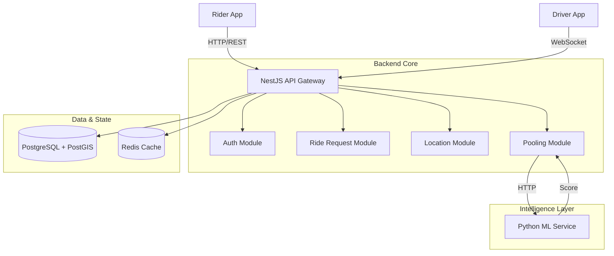

# 🚖 Vectra - Intelligent Ride-Sharing & Pooling Ecosystem

**Vectra** is a high-performance, scalable ride-sharing platform engineered to optimize urban mobility. By fusing **NestJS** microservices, **Socket.IO** real-time event streams, and **Python-based ML**, Vectra delivers a seamless experience for dynamic ride-pooling, solo trips, and fleet management.

---

## 🏗️ System Architecture

The platform follows a modular, event-driven architecture designed for high availability and low latency.



### 1. 🚀 Backend Core (`backend/src`)
*   **NestJS (Node.js + TypeScript)**: Serves as the primary API gateway and business logic handler.
*   **PostgreSQL + PostGIS**: 
    *   Stores relational data (Users, Rides, Transactions).
    *   Executes high-performance geospatial queries (e.g., `ST_DWithin` to find drivers within 3km).
*   **Socket.IO**: Manages persistent connections for:
    *   Real-time Driver Tracking (`driver:location`).
    *   Ride Status Updates (`ride:status`).
*   **Redis**: High-speed caching layer for:
    *   **Geospatial Indexing**: Storing fleeting driver locations for nearest-neighbor search.
    *   **Session Management**: Storing OTPs and ephemeral auth tokens.

### 2. 🧠 Intelligence Layer (`backend/ml-service`)
*   **Python (FastAPI)**: A specialized microservice for compute-intensive tasks.
    *   **Pooling Algorithm**: Analyzes multiple ride requests to find optimal overlaps with minimal detour penalties.
    *   **Demand Prediction**: (Future) Heatmap generation based on historical demand.

### 3. 📱 Mobile Ecosystem (`frontend`)
*   **Framework**: **Flutter**.
*   **State Management**: **BLoC (Business Logic Component)** pattern for predictable state transitions.
*   **Optimizations**: 
    *   **Rider App**: Focused on fast booking flows and map interactivity.
    *   **Driver App**: Battery-optimized background location services and high-contrast navigation UI.

---

## 🛠 Functional Modules Deep Dive

### 1. 🔐 Authentication & Security
*   **Flow**: Mobile-first OTP login (Phone/Email) -> Generic JWT issuance.
*   **RBAC**: Claims-based authorization (`Roles: ['RIDER', 'DRIVER', 'ADMIN']`).
*   **Guards**: `JwtAuthGuard`, `RolesGuard` enforce access control at the controller level.

### 2. 🗺️ Ride Discovery & Matching
*   **Search**: When a rider requests a trip, the system checks Redis for active drivers within a radius (e.g., 5km).
*   **Filter**: Drivers are filtered by:
    *   Vehicle Type (Auto, Bike, Cab).
    *   Status (`ONLINE`, `AVAILABLE`).
*   **Locking**: Uses Redis distributed locks to ensure a driver is not double-booked.

### 3. 🧩 Intelligent Ride Pooling
*   **Logic**:
    1.  **Grouping**: Users requesting similar routes are grouped into a `PoolGroup`.
    2.  **Scoring**: The Python ML service serves a compatibility score (0-1) based on detour distance.
    3.  **Routing**: Dynamic re-sequencing of waypoints (Pickup A -> Pickup B -> Drop A -> Drop B).
*   **Transparency**: Users see guaranteed "Max Detour" times before booking.

### 4. 🛰️ Driver Availability & GPS
*   **Ingestion**: Driver app emits `driver-location` events every 5 seconds.
*   **Storage**:
    *   **Hot**: immediate location to Redis (TTL 30s).
    *   **Cold**: Async write to PostgreSQL `driver_locations` table for history.

### 5. 🛡 Safety & Governance
*   **SOS**: Emergency trigger pushes high-priority WebSocket alerts to Admin Dashboard.
*   **Route Deviation**: Background job monitors actual vs. planned route; alerts if deviation > threshold.
*   **Audit**: "Soft Delete" strategy ensures no data is permanently lost, aiding in disputes.

---

## 🚦 Trip Lifecycle (State Machine)

The ride flow is governed by a strict state machine to prevent illegal transitions.

| State | Description | Trigger |
| :--- | :--- | :--- |
| **SEARCHING** | Looking for nearby drivers. | User requests ride. |
| **OFFERED** | Driver has received request. | Match found. |
| **ASSIGNED** | Driver accepted. | Driver swipes accept. |
| **ARRIVING** | Driver is en route to pickup. | Driver starts Nav. |
| **ARRIVED** | Driver at pickup point. | Geofence / Manual trigger. |
| **IN_PROGRESS** | Journey started. | Trip Start OTP verified. |
| **COMPLETED** | Journey ended. | Payment processed. |
| **CANCELLED** | Trip aborted. | User/Driver cancel. |

---

## 🔌 Real-Time Events API

Key Socket.IO events used for communication:

| Event Name | Direction | Payload | Description |
| :--- | :--- | :--- | :--- |
| `driver:location` | Client -> Server | `{ lat, lng, heading }` | Drivers sending GPS updates. |
| `ride:request` | Server -> Client | `{ rideId, pickup, drop }` | Notifying driver of new job. |
| `ride:status` | Server -> Client | `{ status: 'ARRIVING', eta }` | Updates for Rider UI. |
| `chat:message` | Bi-directional | `{ senderId, text, time }` | In-ride chat. |

---

## ⚙️ Environment Variables

Ensure your `.env` file is configured:

```env
# Database
DB_HOST=localhost
DB_PORT=5432
DB_USER=postgres
DB_PASS=secret
DB_NAME=vectra_db

# Redis
REDIS_HOST=localhost
REDIS_PORT=6379

# JWT
JWT_SECRET=super_secure_secret
JWT_EXPIRATION=7d

# Google Maps
GOOGLE_MAPS_API_KEY=AIzaSy...
```

---

## 🧪 Simulation Mode (Rider App)

The **Rider App** includes a built-in **Simulation Mode** for developers.
*   **How to enable**: It is active by default in Debug builds if the Backend is unreachable.
*   **Features**:
    *   **Mock Auth**: Login with any credentials.
    *   **Mock Booking**: Simulates finding a driver and trip progress (driver icon moves on map).
    *   **Mock History**: Pre-populated trip history for UI testing.

---

## 🚀 Deployment & Setup

### 1. Backend (Docker)
```bash
cd VectraApp/backend
docker-compose up --build
```

### 2. ML Service (Python)
```bash
cd VectraApp/backend/ml-service
pip install -r requirements.txt
python -m uvicorn app.main:app --port 8000
```

### 3. Mobile Apps (Flutter)
```bash
# Rider
cd VectraApp/frontend/rider_app
flutter run

# Driver
cd VectraApp/frontend/driver_app
flutter run
```

---

## 🤝 Contribution Guidelines
1.  **Branching**: `feature/feature-name` or `fix/issue-name`.
2.  **Commits**: Use conventional commits (e.g., `feat: add pooling logic`).
3.  **PRs**: Ensure CI checks pass before merging.

## 📄 License
This project is licensed under the MIT License.
