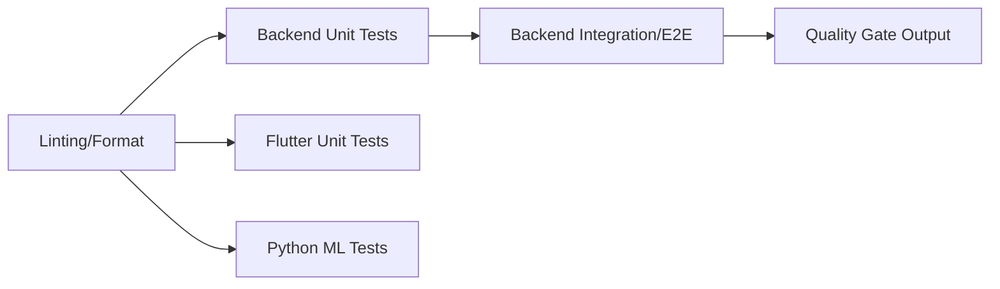

# Vectra — Test Engineering Documentation

## 1. Testing Overview

### 1.1 Purpose of Testing
The purpose of testing in the Vectra ride-sharing platform is to ensure the reliability, safety, and performance of the system for all users (riders, drivers, and administrators). Testing guarantees that critical workflows—like ride requests, dynamic pooling, geospatial routing, and real-time trip status synchronization—function flawlessly under high concurrency.

### 1.2 Quality Goals
* **Reliability:** > 99.9% success rate for end-to-end ride booking flows.
* **Accuracy:** Precise geospatial tracking and location updates with < 10ms latency overhead.
* **Security:** Strict enforcement of RBAC (Role-Based Access Control), JWT validation, and data isolation.
* **Scalability:** System stability under sudden load spikes (e.g., peak hours, event dismissals).
* **Fault Tolerance:** Graceful degradation and exact state recovery during network drops or component failures.

### 1.3 Test Scope
The testing scope encompasses all layers of the Vectra ecosystem:
* **Backend:** NestJS REST APIs, TypeORM (PostgreSQL/PostGIS), Socket.IO WebSockets, Redis Cache.
* **Frontend:** Flutter Rider App, Flutter Driver App, React Admin Dashboard.
* **ML Services:** Python FastAPI models (e.g., pooling optimization algorithms).

---

## 2. Testing Strategy

### 2.1 Testing Pyramid
Vectra strictly adheres to the Testing Pyramid:
1. **Unit Tests (Bottom):** High volume, fast execution. Focused on isolated business logic, helpers, and pure functions.
2. **Integration Tests (Middle):** verifying data flow across boundaries (e.g., Controller → Service → DB → WebSockets).
3. **End-to-End Tests (Top):** Low volume, slower execution. Simulating real user journeys across the entire stack.

### 2.2 Risk-Based Testing Approach
Testing priorities correlate directly with business risk:
* **Critical (P0):** Ride lifecycle, Payment calculation, Driver matching, Incident reporting (Safety).
* **High (P1):** Authentication, WebSocket state synchronization, Driver location streaming.
* **Medium (P2):** Admin reporting, profile updates, ride history.

### 2.3 Automation-First Philosophy
Any scenario executed manually more than twice must be automated. The CI/CD pipeline enforces execution of all automated test suites on every pull request, preventing regressions from merging into production branches.

---

## 3. Test Environment Setup

### 3.1 Local Testing Environment
Engineers run tests against a dedicated local testing environment initialized via Docker Compose.

```bash
# Spin up test dependencies
docker-compose -f docker-compose.test.yml up -d
```

### 3.2 Docker Services
The isolated testing environment provisions containerized instances of:
* **PostgreSQL:** With the PostGIS extension for geospatial operations.
* **Redis:** For pub/sub and caching.

### 3.3 Test Databases
The test database schema corresponds identically to production but operates with a fresh wipe-and-sync capability before test suite execution to prevent cross-test state pollution. `npm run test:e2e` natively manages test database initialization and teardown.

### 3.4 Mock Services
External integrations (e.g., payment gateways, SMS providers) and heavy ML services are strictly mocked during backend testing to maintain determinism and speed.

---

## 4. Unit Testing Strategy

### 4.1 Backend Unit Testing
Written using **Jest**. Every NestJS service and controller must map to a `.spec.ts` file. Dependencies (Repositories, internal services) are mocked using `jest.fn()` or `@golevelup/ts-jest`.

### 4.2 Flutter Unit Tests
Written using **flutter test**. Business logic components (BLoCs, Cubits, Repositories, Providers) are unit-tested independently of the UI framework. External HTTP clients and WebSocket clients are replaced with Mockito/Mocktail mocks.

### 4.3 ML Service Tests
Python tests written using **Pytest**. Evaluates algorithm accuracy, schema validation (Pydantic), and FastAPI endpoint logic via `TestClient`.

### 4.4 Coverage Goals
* **Global Target:** > 85% statement coverage.
* **Critical Modules Target (Auth, Ride matching, Trips, Payments):** > 95% statement coverage.

---

## 5. Integration Testing

### 5.1 Definition
Integration testing in Vectra verifies that distinct sub-systems communicate successfully. Unlike unit tests, integration tests connect to the real (isolated) database and real Redis instances.

### 5.2 Integration Boundaries in Vectra
We explicitly test data transitions across these layers:
* REST API Controller → Service Layer → DB Transactions
* Service Layer → ML External Calls (Mocked)
* Service Layer → SocketGateway → Dynamic Room Booking
* Service Layer → Transactional pessimistic locks (Concurrency control)
* Flutter BLoC Layer → RideRepository (API Calls)
* Flutter TripSocketService → Socket.IO Server Emit/Listen

### 5.3 Controller → Service → DB Tests
Validates that incoming HTTP payloads pass validation pipes, are processed correctly by business logic, and persist correctly through TypeORM to PostgreSQL.

### 5.4 Service → Redis Tests
Ensures specific configurations (e.g., session tokens, rate limits) correctly utilize Redis connection protocols and TTL implementations.

### 5.5 Service → Socket.IO Tests
Crucial for Vectra. Validates that domain state changes (e.g., Trip accepted) synchronously emit exact payloads to the exact socket rooms (`trip_<id>`).

### 5.6 Flutter → API Tests
Uses `MockWebServer` or mocked Repositories to simulate network latency, HTTP error codes, and malformed JSON payloads, verifying that Flutter's Dio/HTTP clients catch and parse these correctly.

---

## 6. API Testing

### 6.1 REST Endpoint Validation
Performed using **Supertest** bound to the NestJS dependency injection system. Tests validate HTTP statuses, JSON schemas, headers, and pagination formats.

### 6.2 Authentication Tests
Verifies correct JWT validation logic, expired token handling, refresh token rotation behaviors, and OTP validation state machines.

### 6.3 Error Handling Tests
Asserts that standard JSON error objects (Status, Timestamp, Message, Path) are returned by global exception filters for cases like 404 (Not Found), 400 (Bad Request), and 409 (Conflict).

### 6.4 Contract Validation
Uses Swagger/OpenAPI specifications to ensure APIs do not deviate from the documented contract, preventing breaking changes for mobile clients.

---

## 7. WebSocket Testing

### 7.1 Socket Connection Tests
Verifies that clients bearing valid JWTs can successfully connect to the Socket.IO namespace, while unauthenticated connections are forcefully severed.

### 7.2 Trip Status Events
Verifies the bidirectional flow: A driver accepts a ride (HTTP) → Server broadcasts `TRIP_STATUS_UPDATED` → Rider socket receives payload → App UI transitions to "Driver En Route".

### 7.3 Location Updates
Simulates high-frequency `location_update` events utilizing PostGIS geometry points. Tests performance and ensures socket rooms isolate broadcasts to only authorized participants in that specific trip.

### 7.4 Chat Messages
Validates delivery receipts, real-time message broadcasting, and offline-queue logic (if push notifications handle offline routing).

---

## 8. End-to-End Testing

### 8.1 Definition
E2E testing spins up the entire backend nest, the database, and drives scenarios that span multiple domains. Mobile E2E uses integration setups or framework wrappers to push buttons on the actual interface.

### 8.2 Rider Requests Ride
A full journey: Rider logs in, fetches pricing, confirms pickup/dropoff, and enters `SEARCHING` state. Assertions target the database to ensure the ride request exists in `PENDING` status.

### 8.3 Driver Accepts Ride
A second authenticated driver client queries for available rides, finds the rider's request, and accepts it. We test the atomic lock preventing two drivers from claiming the same ride.

### 8.4 Trip Lifecycle
The comprehensive "Golden Path". Tests the sequence:
`REQUESTED` → `ASSIGNED` → `ARRIVED` → `IN_PROGRESS` → `COMPLETED`.

### 8.5 Real-time Updates
In E2E, a mock driver emits simulated GPS pings (1 ping / second). The E2E script validates that the rider socket listener successfully receives the exact coordinate series.

---

## 9. Regression Testing

### 9.1 Definition
Re-executing complete suites to confirm recent code changes have not negatively impacted existing functionality.

### 9.2 Automated Regression Suite
The `npm run test:e2e` suite acts as the primary backend automated regression suite. It comprises all known positive flows, negative edge cases, and historical bug reproductions.

### 9.3 Critical Flows Tested
* Ride status transitions.
* Token refresh flow.
* Concurrent ride matching and concurrency deadlocks (Pooling Module).

---

## 10. Database Testing

### 10.1 Schema Validation
Verifies constraints (e.g., unique indices on `phoneNumber`), foreign key cascades, and checks for `user_role` enums.

### 10.2 Migrations Testing
Ensures TypeORM UP/DOWN migrations execute effectively on an empty database and on a database populated with mock data (to simulate production deployment).

### 10.3 Data Integrity
Tests pessimistic locks (e.g., `QueryRunner.setLock('pessimistic_write')`), ensuring no split-brain scenarios occur over trip assignments.

### 10.4 Geospatial Queries
Validates correct query distances (e.g., `ST_DistanceSphere`). Specifically, tests whether the driver search query accurately locates drivers within the specified radius threshold using PostGIS indices.

---

## 11. Mobile App Testing

### 11.1 Flutter Widget Tests
Validates UI components without booting the full Flutter engine. Tests assert the presence of Text elements, color themes, list bounds, and button interactivity.

### 11.2 UI Flows
Uses `Integration Test` package in Flutter to automate device interactions. Navigates from the splash screen to the map, interacts with bottom sheets, and finalizes flows mimicking human touch.

### 11.3 Offline Scenarios
Simulates loss of network connectivity (`ConnectivityPlus`). Evaluates how BLoCs handle caching, queueing location pings, and displaying appropriate "Offline Mode" visual indicators.

### 11.4 GPS Simulations
Feeds mock NMEA/GPS streams into the Flutter location framework to verify map rendering logic and route polyline following.

---

## 12. Performance Testing

### 12.1 Load Testing APIs
Simulates 10,000+ simultaneous ride requests originating from high-density geographical areas (e.g., airport dismissal).

### 12.2 Socket Scalability
Tests the system's ability to maintain high throughput. Ensures the Node.js event loop does not block when broadcasting 50,000 location pings per second across Redis adapters.

### 12.3 Database Performance
Identifies slow queries. Validates that PostGIS geometry indices and B-Tree indices are utilized instead of Sequential Scans.

---

## 13. Security Testing

### 13.1 JWT Validation
Asserts that tampered signatures, expired `exp` claims, or incorrect algorithm types immediately throw HTTP 401 Unauthorized. Verify secret rotations block old tokens.

### 13.2 RBAC Testing (Role-Based Access Control)
Guarantees a `RIDER` JWT attempting to access `AdminController` or `DriverController` routes results in HTTP 403 Forbidden.

### 13.3 Input Validation
Tests payload boundaries. Attempts SQL Injection, XSS payloads via chat strings, out-of-bounds Lat/Lng coordinates (>90, >180), and malicious type-casting. Handled globally via `ValidationPipe`.

### 13.4 Rate Limiting
Verifies brute-force protection (e.g., OTP endpoint rate limiting to prevent spamming SMS provider).

---

## 14. CI/CD Testing Pipeline

### 14.1 GitHub Actions
Vectra testing runs in highly-parallelized GitHub Action pipelines scoped to unique Pull Requests.

### 14.2 Test Stages


### 14.3 Quality Gates
If coverage drops below the targeted threshold, or a single test fails, the CI status fails, blocking the `Merge` button automatically.

---

## 15. Test Data Management

### 15.1 Seed Data
Controlled scripts populate identical baseline data sets (Base admin users, test regions, vehicle types) to bootstrap test runs reliably.

### 15.2 Mock Users
Dynamic generation of synthetic PII (Names, spoofed localized phone numbers) allowing parallel threads to create accounts simultaneously without collision.

### 15.3 Mock Trips
Scripts dynamically instantiate specific ride topologies (e.g., Trip `T-88` is frozen in `IN_PROGRESS` state) requiring no UI interaction to skip into downstream edge testing.

---

## 16. Automation Tools

| Tool | Purpose | Area |
|------|---------|------|
| **Jest** | Unit and Integration Testing | Backend (NestJS) |
| **Supertest** | HTTP Request Simulation | Backend APIs |
| **Playwright/Cypress** | Web E2E (Dashboard) | React Frontend |
| **Flutter Test** | Unit, Widget, and Integration tests | Flutter Mobile Apps |
| **k6 / Locust** | Scalability and Load Testing | Performance / API |
| **Pytest** | ML algorithm testing | Python FastAPI |

---

## 17. Test Case Examples

### 17.1 API Test Case (Unit)
```typescript
it('should throw UnauthorizedException if OTP is incorrect', async () => {
    mockOtpService.verifyOtp.mockResolvedValue(false);
    await expect(authService.verifyDriverOtp('1234567890', '0000', 'client-id'))
        .rejects.toThrow(UnauthorizedException);
});
```

### 17.2 Integration Test Example
```typescript
it('INT-POOL-002: Race Condition rollback on double-booking', async () => {
    // Both drivers hit finalize pool at the same millisecond
    const p1 = poolingService.finalizePool({ riders: [r1] });
    const p2 = poolingService.finalizePool({ riders: [r1] });
    const results = await Promise.all([p1, p2]);
    
    // One hits a pessimistic lock denial, rolling back transaction cleanly
    expect(results.filter(r => r === null).length).toBe(1); 
});
```

### 17.3 E2E Test Scenario (Flutter)
```dart
testWidgets('Full rider request flow UI transition', (WidgetTester tester) async {
    await bootstrapApp(tester);
    await tester.tap(find.text('Confirm Pickup Location'));
    await tester.pumpAndSettle();
    
    expect(find.text('Searching for drivers...'), findsOneWidget);
    
    // Simulate socket event
    mockTripSocketService.triggerStatus('ASSIGNED');
    await tester.pumpAndSettle();
    
    expect(find.text('Driver En Route'), findsOneWidget);
});
```

---

## 18. Quality Metrics

### 18.1 Test Coverage Targets
* > 85% Code lines hit across backend repos.
* 100% boundary testing on Payment and Location synchronization.

### 18.2 Defect Tracking
Engineers link tests directly to Jira tickets. If a bug escapes to production, an explicit Integration or E2E test must be written reproducing the issue before the bug-fix is merged (Test-Driven Bug Fixing).

### 18.3 Release Criteria
1. ZERO Critical/High severity bugs.
2. 100% CI pipeline test suite pass rate.
3. Successful completion of automated E2E sweep spanning both platform applications over staging environment.

---

## 19. Testing Checklist

### 19.1 Pre-release Validation List
- [ ] Backend Unit tests executed & passed.
- [ ] Backend Integration tests executed & passed.
- [ ] Flutter Widget tests executed & passed.
- [ ] Auth boundaries explicitly verified (e.g. Expired tokens).
- [ ] Database migration `up / down` scripts tested.
- [ ] PostGIS query performance vetted successfully.
- [ ] Mobile UX confirmed on iOS and Android targets.

---

## 20. Troubleshooting Tests
* **Flaky E2E Tests:** Ensure await/async patterns are fully exhausted before making database assertions. Eliminate `setTimeout` usages in favor of event stream polling or WebSocket `Mock.waitFor()`.
* **Database Connection Leaks:** Ensure the `beforeEach()` / `afterEach()` blocks explicitly wipe TypeORM or close active `DataSource` connections to prevent connection pool exhaustion.
* **Socket Events Missing:** Validate authentication context configuration inside the E2E test bootstrap process; WebSockets universally reject unauthenticated hooks silently.
